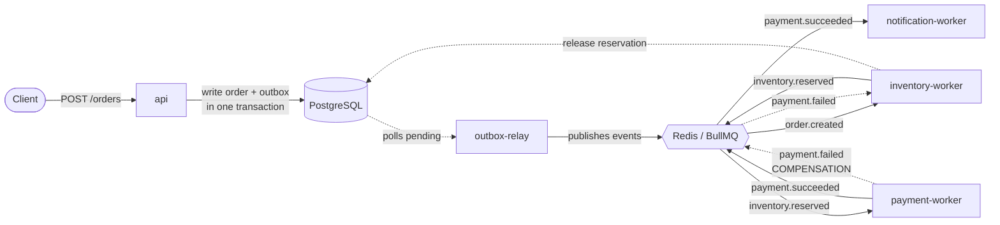

# OrderFlow Engine

> A fault-tolerant, event-driven order processing system.
> Five independent processes communicating **exclusively through queue events**, with zero direct calls between services.

<p>
  
  
  
  
  
  
</p>

---

## What this system is

A customer places an order through the API, and the system processes it in the background (asynchronously, via a queue) through a series of steps: reserve inventory, process payment, send notification. The whole process is fault-tolerant. If any service crashes at any point, the system resumes correctly after restart, with no duplicates and no data loss.

## The problem it solves

In a typical e-commerce system the steps inventory, payment and notification are spread over time and can fail independently. Done synchronously in a single request/response, they cause: blocked requests, data loss if the server crashes mid-processing, risk of double-charging a card on retry, and no way to undo a partially completed operation (inventory reserved, but payment failed).

OrderFlow addresses this by breaking the process into independent, asynchronous steps tied together with delivery and idempotency guarantees.

## How it works



1. `POST /orders`: the API writes the order **and** an `order.created` event to the `outbox` table in a single transaction, then returns `202 Accepted`.
2. `outbox-relay` periodically publishes unsent events from the database to the queue.
3. `inventory-worker` reserves stock and emits `inventory.reserved` (or `inventory.rejected`).
4. `payment-worker` processes the payment idempotently and emits `payment.succeeded` (or `payment.failed`).
5. If payment fails, `payment.failed` is routed back to `inventory-worker`, which **releases the reservation** (compensation).
6. If it succeeds, `notification-worker` "sends" the email and emits `notification.sent` (a terminal event).

## Patterns implemented

| Pattern                            | Role                                                                                                                                           | Where                                                       |
| ---------------------------------- | ---------------------------------------------------------------------------------------------------------------------------------------------- | ----------------------------------------------------------- |
| **Outbox pattern**                 | Atomic write of data + event in a single DB transaction, so there is no inconsistency if the process crashes between the write and the publish | `api`, every worker that emits an event                     |
| **Idempotency**                    | Protection against processing the same event twice (unique `order_id` on state tables)                                                         | `inventory-worker`, `payment-worker`, `notification-worker` |
| **Retry with exponential backoff** | Transient errors (timeout, temporary unavailability) are retried with an increasing delay instead of failing immediately                       | BullMQ config in `outbox-relay`                             |
| **Dead-letter queue**              | Permanently failing jobs land in the `dead_letters` table instead of blocking the system                                                       | `payment-worker`                                            |
| **Saga pattern**                   | Compensation of a distributed transaction by emitting a reverse event (`payment.failed` releases inventory)                                    | `payment-worker` to `inventory-worker`                      |

### Key property: at-least-once delivery

The relay publishes an event **before** marking it as sent, so if it crashes between those steps the event may be delivered to the queue a second time. This is intentional: we guarantee "at least once", not "exactly once". Duplicates are neutralized by consumers via idempotency. Outbox and idempotency are two sides of the same coin. The producer guarantees "it will arrive at least once", the consumer guarantees "a duplicate does no harm".

## Stack

```
Runtime:      Node.js 22 LTS + TypeScript (ESM / NodeNext)
API:          Fastify 5 + fastify-type-provider-zod
Queue:        BullMQ 5 + Redis 7
Database:     PostgreSQL 16 + Drizzle ORM
Validation:   Zod
Logging:      Pino
Testing:      Vitest + Testcontainers   (roadmap)
Infra:        Docker Compose
Monorepo:     pnpm workspaces
```

## Structure

Five independent processes plus a shared database:

```
orderflow-engine/
├── apps/
│   ├── api/                          # accepts orders (POST /orders)
│   ├── outbox-relay/                 # publishes events from DB to the queue
│   └── workers/
│       ├── inventory-worker/         # reserve / release inventory
│       ├── payment-worker/           # process payments + DLQ
│       └── notification-worker/      # send notifications
├── docker-compose.yml                # Postgres + Redis
├── pnpm-workspace.yaml
├── tsconfig.base.json
└── package.json
```

## Data model

| Table                    | Role                                                                                   |
| ------------------------ | -------------------------------------------------------------------------------------- |
| `orders`                 | source of truth: placed orders                                                         |
| `outbox`                 | outgoing event buffer (`pending` to `published`)                                       |
| `inventory`              | real per-SKU stock level                                                               |
| `inventory_reservations` | reservations (`reserved` / `rejected` / `released`), unique `order_id` for idempotency |
| `payments`               | payments (`succeeded` / `failed`), unique `order_id` for idempotency                   |
| `notifications`          | sent notifications (`confirmation` / `cancellation`)                                   |
| `dead_letters`           | durable trace of jobs that exhausted all retry attempts                                |

## Event flow

| Event                | Emitted by            | Consumed by (queue)        |
| -------------------- | --------------------- | -------------------------- |
| `order.created`      | `api`                 | `inventory`                |
| `inventory.reserved` | `inventory-worker`    | `payment`                  |
| `inventory.rejected` | `inventory-worker`    | `notification`             |
| `payment.succeeded`  | `payment-worker`      | `notification`             |
| `payment.failed`     | `payment-worker`      | `inventory` (compensation) |
| `notification.sent`  | `notification-worker` | none (terminal)            |

---

## Getting started

### Requirements

- Node.js 22 LTS
- pnpm 9
- Docker (Docker Desktop on Windows/macOS)

### Steps

```bash
# 1. Install dependencies
pnpm install

# 2. Infrastructure (Postgres + Redis)
docker compose up -d
docker compose ps        # both services should be "healthy"

# 3. Run migrations
pnpm --filter @orderflow/api db:generate
pnpm --filter @orderflow/api db:migrate

# 4. Seed inventory (test data)
docker compose exec postgres psql -U orderflow -d orderflow -c \
  "INSERT INTO inventory (sku, available) VALUES
     ('ABC',100),('DEF',50),('GHI',5),('FAIL-CARD',100),('TIMEOUT-GW',100)
   ON CONFLICT (sku) DO NOTHING;"
```

### Start the processes

Each in its own terminal:

```bash
pnpm --filter @orderflow/api dev
pnpm --filter @orderflow/outbox-relay dev
pnpm --filter @orderflow/inventory-worker dev
pnpm --filter @orderflow/payment-worker dev
pnpm --filter @orderflow/notification-worker dev
```

---

## Verifying it works

### Happy path

```bash
curl -X POST localhost:3000/orders \
  -H "content-type: application/json" \
  -d '{"customerId":"11111111-1111-1111-1111-111111111111","items":[{"sku":"ABC","quantity":1}]}'
```

> **PowerShell:** use `Invoke-RestMethod` instead of `curl` (the `curl` alias in PowerShell is `Invoke-WebRequest`, which has different syntax):
>
> ```powershell
> $b = @{ customerId="11111111-1111-1111-1111-111111111111"; items=@(@{sku="ABC";quantity=1}) } | ConvertTo-Json
> Invoke-RestMethod -Uri http://localhost:3000/orders -Method Post -ContentType "application/json" -Body $b
> ```

Trace the order's lifecycle through the outbox:

```bash
docker compose exec postgres psql -U orderflow -d orderflow -c \
  "select event_type, status from outbox
   where aggregate_id = (select order_id from notifications order by created_at desc limit 1)
   order by created_at;"
```

Expected chain: `order.created`, `inventory.reserved`, `payment.succeeded`, `notification.sent`.

### Failure scenarios (driven by SKU)

The mock payment gateway reacts to the SKU name:

| SKU contains | Behavior                              | Effect                                                      |
| ------------ | ------------------------------------- | ----------------------------------------------------------- |
| `FAIL`       | card declined (**permanent** error)   | `payment.failed`, compensation releases inventory, no retry |
| `TIMEOUT`    | gateway timeout (**transient** error) | 5x retry with backoff, then job lands in `dead_letters`     |
| (other)      | success                               | `payment.succeeded`                                         |

```bash
# Compensation (saga): inventory reserved and returned, net stock unchanged
curl -X POST localhost:3000/orders -H "content-type: application/json" \
  -d '{"customerId":"11111111-1111-1111-1111-111111111111","items":[{"sku":"FAIL-CARD","quantity":3}]}'

# Dead-letter: watch the retries in the payment-worker log, then check the table
curl -X POST localhost:3000/orders -H "content-type: application/json" \
  -d '{"customerId":"11111111-1111-1111-1111-111111111111","items":[{"sku":"TIMEOUT-GW","quantity":1}]}'

docker compose exec postgres psql -U orderflow -d orderflow -c \
  "select job_id, queue, event_type, error, attempts from dead_letters;"
```

---

## Design notes

- **The outbox is an outgoing buffer, not the source of truth.** The source of truth is the state tables (`orders`, `inventory`, `payments`). This is what distinguishes the pattern from event sourcing, where the event log itself is the source of truth.
- **The relay is safe to run in multiple instances.** It fetches rows with `SELECT ... FOR UPDATE SKIP LOCKED`, so parallel instances never publish the same event.
- **Payment distinguishes error types.** Transient (throw an exception, BullMQ retries) versus permanent (record `failed` and emit an event, no retry). Confusing the two is a classic mistake: either pointlessly hammering the gateway, or dropping something that would have gone through a second later.
